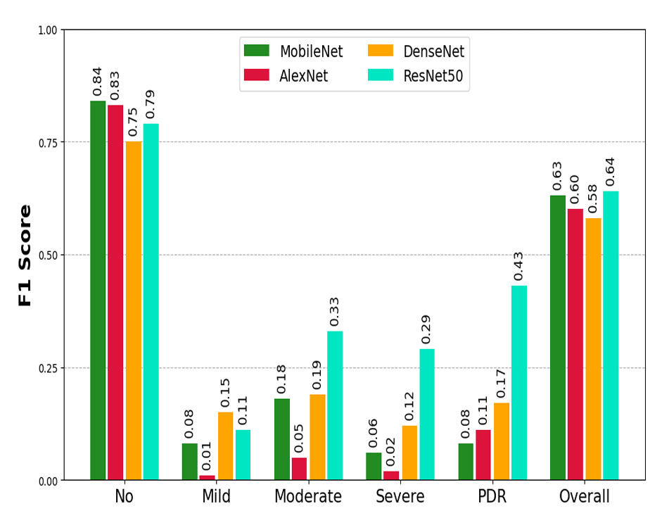
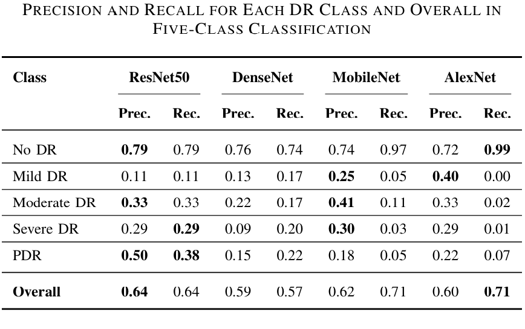
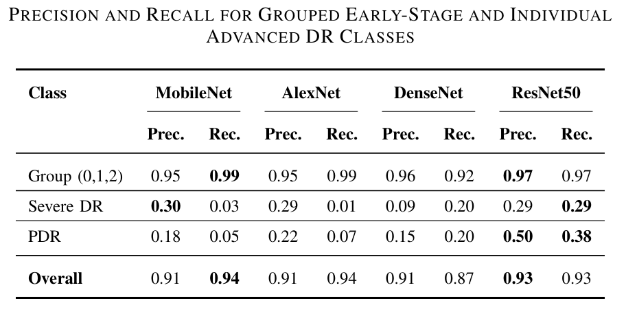
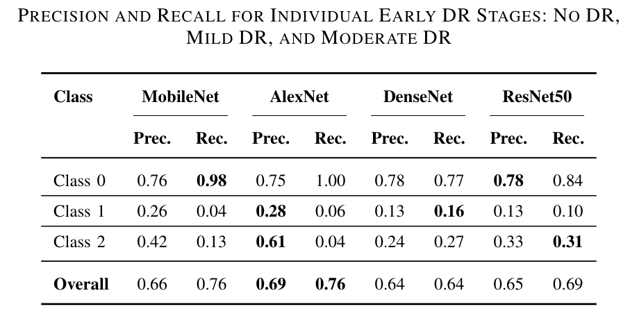

## 📊 Results Overview

This section presents the performance of our models in three stages:  
1. **Five-Class Classification (Direct)**  
2. **Round 1 – Initial Cascade Stage**  
3. **Round 2 – Final Cascade Stage**

---

### **1️⃣ Five-Class Classification (Direct)**

**F1-Scores**  

**Precision & Recall Table**  

---

### **2️⃣ Round 1 – Initial Cascade Stage**

**F1-Scores**  

**Precision & Recall Table**  

---

### **3️⃣ Round 2 – Final Cascade Stage**

**F1-Scores**  

**Precision & Recall Table**  

